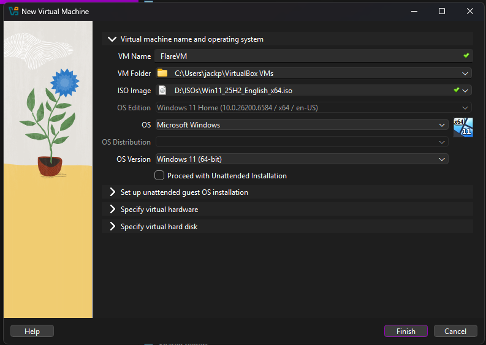
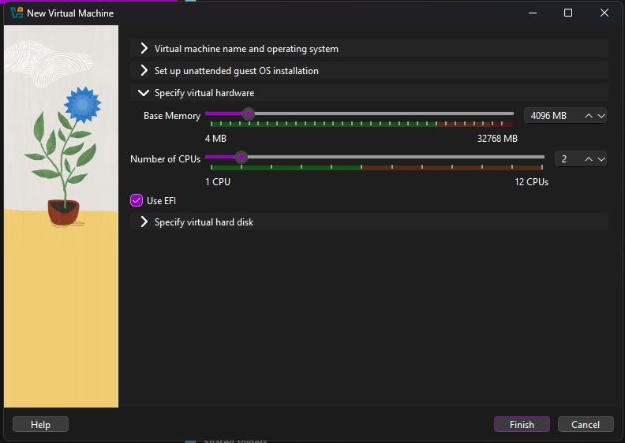
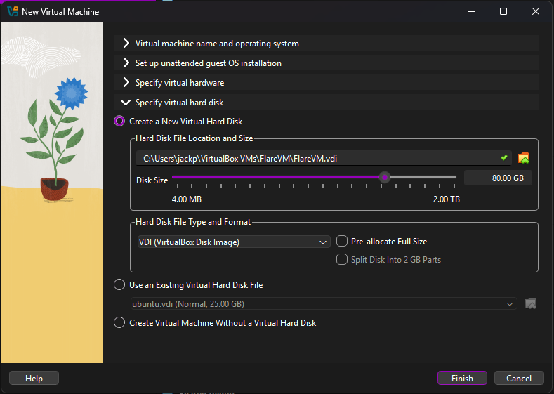
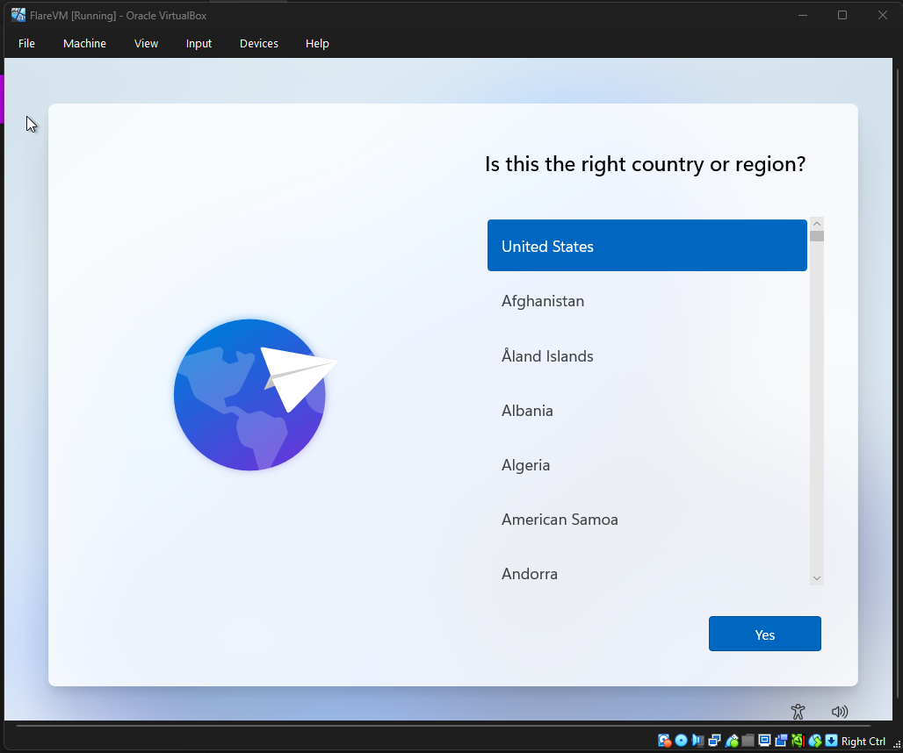

# flarevm-win11-guide

> <small>At the time of writing this the FlareVM install takes 10+ hours. I have had a successful installation on two AMD systems, but results may vary.</small>

## Steps
1. Install [VirtualBox](https://www.virtualbox.org/wiki/Downloads)
2. Download [Windows iso](https://www.microsoft.com/en-us/software-download/windows11)
3. Create Virtual Machine
	1. Name your vm and select downloaded iso.
	
	2. Select at least 2gb of memory and 2 cpu cores.
	
	3. Set disk size to at least 60gb.
	
4. Install Windows 11
	1. Go through set up until you get to the select country screen
	
	2. Press SHIFT + F10 and enter 'OOBE\BYPASSNRO', the VM will restart
	3. Press SHIFT + F10 and enter 'ipconfig /release'. Close command prompt and continue with setup without connecting to internet.
	4. After setup you may have to restart for the internet to work again.
5. Take a snapshot of the machine now that windows is installed
	1. In VirtualBox window, Machine > Take Snapshot...
6. Disable Defender 
	1. Enter safe boot
		1. Windows key + R
		2. msconfig
		3. Boot tab
		4. Select Safe boot, Minimal and press OK
		5. Restart
	2. Modify the registry
		1. Windows key + R
		2. regedit
		3. Navigate to HKEY_LOCAL_MACHINE\SYSTEM\CurrentControlSet\Service
		4. In the following folders modify the key Start to 4
			1. WdBoot
			2. WdFilter
			3. WdNisDrv
			4. WdNisSvc
			5. WinDefend
	3. Exit Safe Mode
		1. Windows key + R
		2. msconfig
		3. Boot tab
		4. Unselect Safe boot and press OK
		5. Restart
7. Enable Guest Additions (For Fullscreen)
	1. In VirtualBox window, Devices > Insert Guest Additions CD image...
	2. Navigate to 'CD Drive (D:) VirtualBox Guest Additions'
	3. Run the .exe corresponding to your architecture
		1. VBoxWindowsAdditions.exe for intel 64 bit
		2. VBoxWindowsAdditions-amd64 for AMD systems
		3. VBoxWindowsAdditions-arm64 for Apple silicon
		4. VBoxWindowsAdditions-x86 for 32 bit systems
	4. After reboot, you should be able to change the screen resolution under the View menu.
8. Take another snapshot of pre-installation state
9. Complete the [install guide](https://github.com/mandiant/flare-vm)
	1. If you get stuck in a boot loop repeatedly trying to install the first package like I did, you may need to stop the install script, restart your VM, and try again.

### References
- [FlareVM Repo](https://github.com/mandiant/flare-vm)
- [Install Windows Without an Account](https://www.tomshardware.com/how-to/install-windows-11-without-microsoft-account)
- [Windows 11 FlareVM guide](https://blog.cyberops.team/windows-11-24h2-flare-vm-malware-analysis-vm-setup-guide/)
