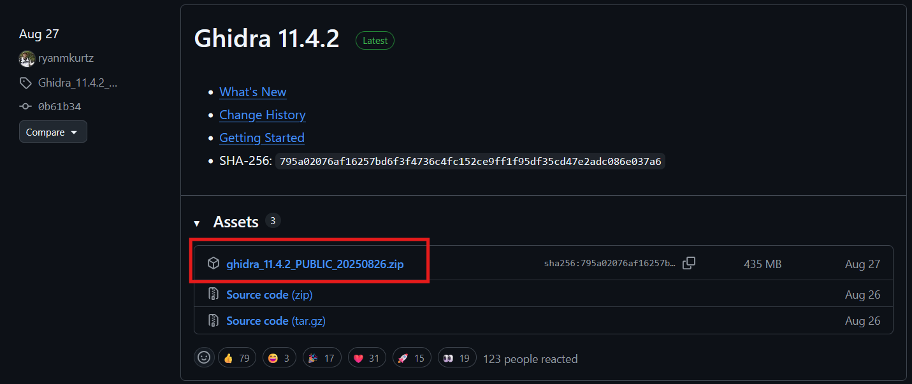
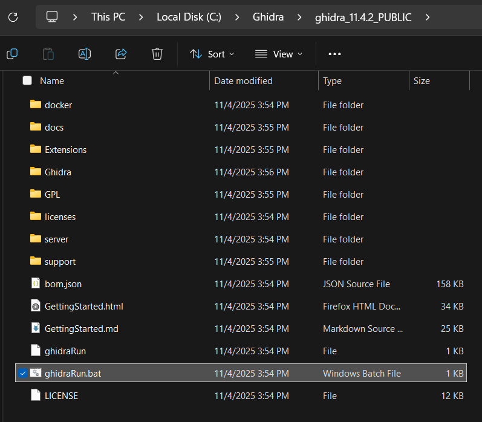
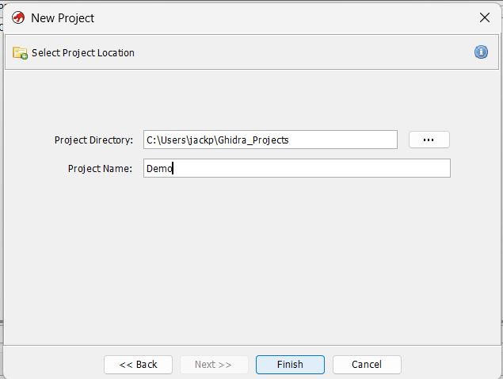
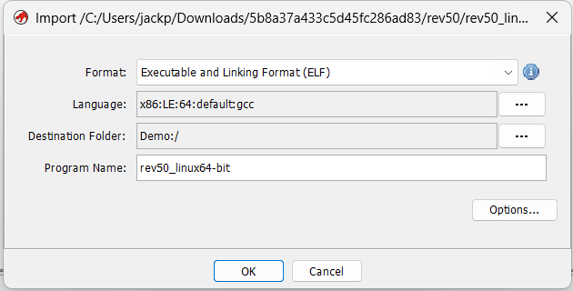
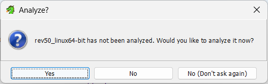
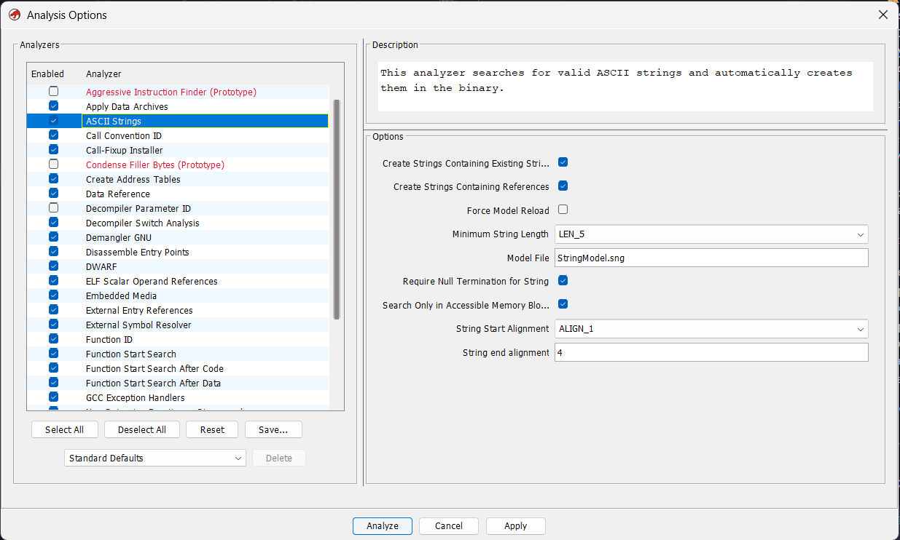
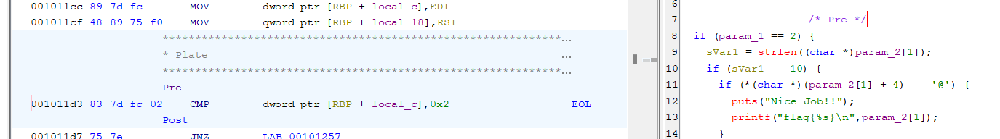

# ghidra basics

## Installation
1. Download latest release [GitHub](https://github.com/NationalSecurityAgency/ghidra/releases)

2. Extract file to C:/Ghidra
3. Navigate to C:\Ghidra\ghidra_xx.xx.xx_PUBLIC and run ghidrarun.bat

4. If you encounter the error "Java runtime not found"
  1. Download and install the Java JDK, making sure to add JDK bin to PATH.

## Creating a project
1. File > New Project
2. Select Non-Shared Project
3. Select a project name and location, then Finish

## Analysing a file
1. Add a file using File > Import File or drag and drop into the project manager
2. Confirm that the format and language are as expected, and continue.

3. After the import is complete, double click on the file to open.
4. The first time you open the file you will be asked if you want to analyze it, select yes.

5. Analyze with defaults

## Basic Features
1. Navigate to functions in the Symbol Tree
2. Rename variables by highlighting them and pressing 'L'
3. Retype variables by highlighting them and pressing 'Crtl + L'
4. Leave comments by pressing ':' (only pre comments show up in the Decompiled view)

5. Edit function signature by right clicking on function and selecting 'Edit Function Signature'

### References
- [How to Install Ghidra on Windows](https://allabouttesting.org/how-to-install-ghidra-on-windows/)
- [Ghidra quickstart & tutorial: Solving a simple crackme](https://youtu.be/fTGTnrgjuGA?si=2eUhWF6MuUIZ4pxn)

